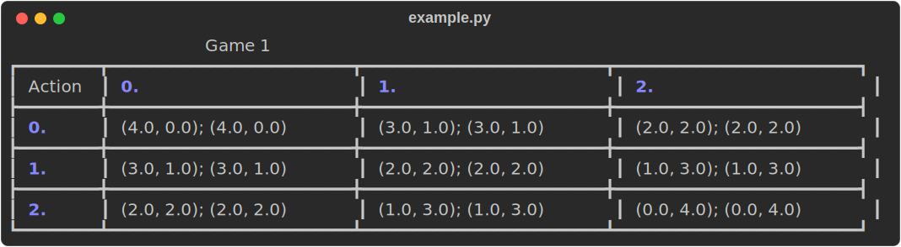
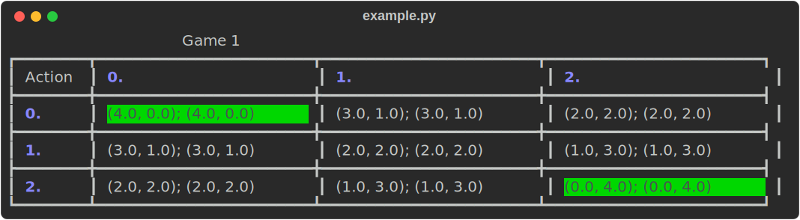
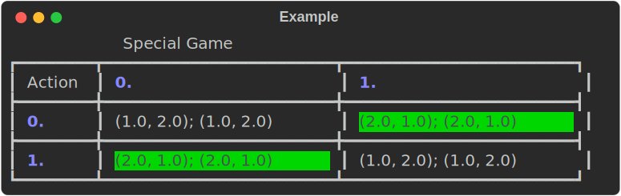

Examples
=====================
Ramo allows game theory researchers to quickly verify novel ideas, run experiments and visualise the results. Due to its size, getting started with Ramo may seem daunting. Below, we will present and work out three concrete examples that display a range of possible use cases.

.. note::
    If you believe that a critical use case is not covered in these examples, please do not hesitate to `open an issue <https://github.com/wilrop/ramo/issues>`_.

Example 1: Solving a game
---------------------------
The most basic use for Ramo is to solve a game. Solving a game might entail computing a sample equilibrium, retrieving all equilibria or letting us know that no equilibrium exists. Some of these questions are still active areas of research and can as such not be easily answered. However, we can (partially) address most of them directly from within Ramo.

To begin, let us import a predefined game and utility functions.

.. code-block:: Python

    from ramo.game.example_games import get_monfg
    from ramo.utility_function.functions import get_u

    game = get_monfg('game1')  # Get a predefined game.
    u1, u2 = get_u('u1'), get_u('u1')  # Get a utility function.

Due to Ramo's printing module, we can visualise the payoffs of this game to get a better idea of its structure. We can do this by simply typing:

.. code-block:: Python

    import ramo.printing as pt
    pt.print_monfg(game, 'Game 1')

This results in a game matrix that should look like this:

Ramo comes with a collection of games and utility functions that are frequently used in research. In this case, the two utility functions are strictly convex, meaning that we can apply the *MOQUPS* algorithm to compute the full set of pure strategy Nash equilibria in this game. We can do that by making a tuple of all the utility functions and calling the *MOQUPS* algorithm on the game and utility functions.

.. code-block:: Python

    from ramo.nash.moqups import moqups
    u_tpl = (u1, u2)
    psne = moqups(game, u_tpl)
    print(psne)

This prints the list :code:`[[array([1., 0., 0.]), array([1., 0., 0.])], [array([0., 0., 1.]), array([0., 0., 1.])]]`. Again, we can visualise this by utilising Ramo's printing functionality:

.. code-block:: Python

    from ramo.strategy.operations import make_profile_from_pure_joint_strat
    action_profiles = [make_profile_from_pure_joint_strat(joint_strat) for joint_strat in psne]
    pt.print_monfg(game, 'Game 1', highlight_cells=action_profiles)

This draws the same game as before but highlights the Nash equilibria in the game.

We can use exactly the same setup as described here to find a sample mixed strategy Nash equilibrium using either Fictitious Play (FP) or Iterated Best Response (IBR). It's as simply as setting a different algorithm!

.. code-block:: Python

    from ramo.nash.fictitious_play import fictitious_play
    from ramo.nash.IBR import iterated_best_response

    ne_fp = fictitious_play(game, u_tpl)
    ne_ibr = iterated_best_response(game, u_tpl)

Example 2: Running baseline algorithms
----------------------------------------
When doing research or writing papers, it is often important to benchmark your algorithms to existing state of the art. This process is made tedious by a lack of standard baseline implementations and environments, requiring everyone to come up with their own. Luckily in Ramo, we provide several learning algorithms which work out of the box on all our games and utility functions.

Let's first define your experimental setup. We gan generate some random game from the :code:`game.generators` module. The code below will generate a game with payoffs randomly drawn from a discrete uniform distribution.

.. code-block:: Python

    from ramo.game.generators import discrete_uniform_monfg
    from ramo.utility_function.functions import get_u

    game = discrete_uniform_monfg(player_actions=(3, 3), num_objectives=2, reward_min_bound=0, reward_max_bound=5)
    u1, u2 = get_u('u1'), get_u('u1')
    u_tpl = (u1, u2)

After having defined your setup, running an experiment with one of the algorithms is as simply as defining the parameters and calling the executor:

.. code-block:: Python

    from ramo.learner.execute_learner import execute_learner

    experiment = 'indep_ac'  # Independent actor critic.
    runs = 2
    episodes = 10
    rollouts = 10

    data = execute_learner(game, u_tpl, experiment=experiment, runs=runs, episodes=episodes, rollouts=rollouts)
    returns_log, action_probs_log, state_dist_log, metadata = data

Experiments on simple learners return a tuple of four items that can be used in visualisations of the learning process. The first item is a log of the vector valued returns all players received throughout the experiment. The second item shows the evolution of the strategies that players learned. The third item is the joint state distribution. This can for example be used to visualise the states players opted for in distinct stages of the learning process. Lastly, metadata is returned so that experiments can be reproduced easily.

To make this process as interoperable as possible, the exact same setup can be used for experiments which make use of commitment. Commitment is a method where one player commits to playing something in the following round, letting the other player condition their response on this commitment.

.. note::
    Commitment learners are only designed for two-player games.

Below, we show an example where we make use of the non-stationary learning algorithm. This algorithm allows followers to learn a best-response strategy to mixed strategies of the leader. Note that we set :code:`alternate = False`, meaning that we are playing a pure commitment game where one player is the leader in all iterations and the other remains the follower.

.. code-block:: Python

    from ramo.commitment.execute_commitment import execute_commitment

    experiment = 'non_stationary'
    runs = 2
    episodes = 10
    rollouts = 10
    alternate = False

    data = execute_commitment(game, u_tpl, experiment=experiment, runs=runs, episodes=episodes, rollouts=rollouts, alternate=alternate)
    returns_log, action_probs_log, state_dist_log, com_probs_log, metadata = data

Example 3: Hypothesis testing
----------------------------------
We've now shown some of the most basic use cases that will be useful. However, one of the main selling points of Ramo is the fact that it is a full API. It allows you to pick and choose useful parts in order to test some hypothesis that you have and analyse it to completion. Below we'll run you through an example.

Let's first define two custom utility function. A utility function can be any Python function you want, given that it returns a scalar value.

.. code-block:: Python

    def u1(vec):
        x, y = vec
        return x ** 2 + y

    def u2(vec):
        x, y = vec
        return x ** 2 + x * y + y ** 2

    u_tpl = (u1, u2)

Ramo comes with a module which allows you to analyse (utility) functions. This is useful when certain algorithms or properties only work for a specific class of functions. Ramo can test for (strict) convexity and concavity as well as (multi)linearity.

.. warning::
    Function checking is currently in an experimental stage and we do not encourage using it without performing additional analysis. We are investigating possible updates for the future.

In order for Ramo to check your function, you have to define your function with Sage. Here, we redefine the same utility functions as before and confirm that the first is a convex function while the second is a strictly convex function.

.. code-block:: Python

    from sympy.abc import x, y
    from ramo.utility_function.checking import is_convex, is_strictly_convex

    symb_u1 = x ** 2 + y
    res1 = is_convex(symb_u1)
    print(res1)

    symb_u2 = x ** 2 + x * y + y ** 2
    res2 = is_strictly_convex(symb_u2)
    print(res2)

For good measure we can also check whether utility function 1 is strictly convex, which should return :code:`False` as it isn't.

.. code-block:: Python

    res3 = is_strictly_convex(symb_u1)
    print(res3)

Next we also define a custom MONFG. MONFGs in Ramo have a custom class, which we can initiate by simply passing a list of payoff matrices to the constructor. Similar to the functionality for utility functions, we can also check some properties of our games. One property that is often annoying in games is when they are *degenerate*. Ramo allows you to check if a game is degenerate *in pure strategies*.

.. code-block:: Python

    import numpy as np
    from ramo.game.monfg import MONFG
    from ramo.game.checking import is_degenerate_pure

    payoffs = [np.array([[(1, 2), (2, 1)],
                         [(1, 2), (1, 2)]], dtype=float),
               np.array([[(1, 2), (2, 1)],
                         [(2, 1), (1, 2)]], dtype=float)]

    monfg = MONFG(payoffs)
    res = is_degenerate_pure(monfg)
    print(res)

It turns out that this game is in fact degenerate, which is unfortunate. However, we can quickly resolve this by changing the payoffs for player 1 and rechecking for degeneracy in pure strategies.

.. code-block:: Python

    payoffs = [np.array([[(1, 2), (2, 1)],
                         [(2, 1), (1, 2)]], dtype=float),
               np.array([[(1, 2), (2, 1)],
                         [(2, 1), (1, 2)]], dtype=float)]

    monfg = MONFG(payoffs)
    res = is_degenerate_pure(monfg)
    print(res)

A sensible first step at this point would be to check what the pure strategy Nash equilibria are in this game. Given that both utility functions are convex, we can use the *MOQUPS* algorithm for this purpose.

.. code-block:: Python

    from ramo.nash.moqups import moqups

    psne = moqups(monfg, u_tpl)
    print(psne)

It turns out there are two: :code:`[[array([1., 0.]), array([0., 1.])], [array([0., 1.]), array([1., 0.])]]`. We can visualise these equilibria on the payoff matrices to get a better feel of the structure.

.. code-block:: Python

    from ramo.printing import print_monfg
    from ramo.strategy.operations import make_profile_from_pure_joint_strat

    action_profiles = [make_profile_from_pure_joint_strat(ne) for ne in psne]
    print_monfg(monfg, 'Special Game', action_profiles)

This returns you a nice overview that should look as the image below.

When inspecting these payoffs, there appears to be a sort of symmetry which might allow for mixed strategy Nash equilibria to exist as well. Let's conjecture for a second that :math:`s_1 = \left(\frac{1}{2}, \frac{1}{2}\right)` and :math:`s_2 = \left(\frac{1}{2}, \frac{1}{2}\right)` is a Nash equilibrium. We can encode this strategy by doing:

.. code-block:: Python

    strat1 = np.array([0.5, 0.5])
    strat2 = np.array([0.5, 0.5])
    joint_strat = [strat1, strat2]

We can now check the expected vectorial payoff for both players by calling a function on the correct payoff matrix and joint strategy.

.. code-block:: Python

    from ramo.strategy.best_response import calc_expected_returns

    exp1 = calc_expected_returns(0, monfg.payoffs[0], joint_strat)
    print(exp1)

    exp2 = calc_expected_returns(1, monfg.payoffs[1], joint_strat)
    print(exp2)

The output from this function should look like below.

::

    [[1.5 1.5]
     [1.5 1.5]]
    [[1.5 1.5]
     [1.5 1.5]]

This indicates that for both players, the expected payoff for their two actions are exactly the same. You can actually show that this implies that the joint strategy is a Nash equilibrium. We can verify that this is a Nash equilibrium by calling a verification function on the game with the joint strategy.

.. code-block:: Python

    from ramo.nash.verify import verify_nash

    is_ne = verify_nash(monfg, u_tpl, joint_strat)
    print(is_ne)

Under the hood, the verification algorithm runs a global optimisation routine to check that no player can change their strategy and still obtain a higher utility. The return from our verification is :code:`True`, meaning that the strategy is indeed a Nash equilibrium and shows the exploratory power of Ramo!